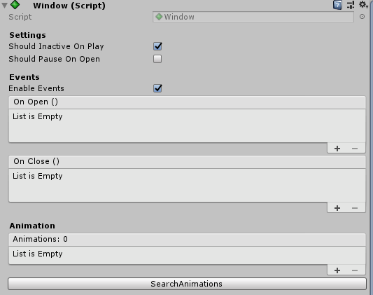
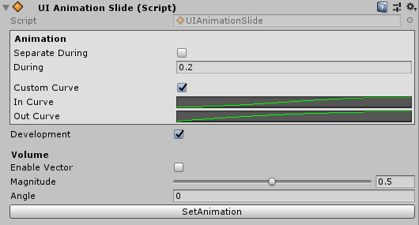

## Get Start
ベーシックなUIのライブラリです.  
インスペクタ上で簡単に設定できます.  
DOTWEENをラッピングしています.

[Releases - unitypackage download](https://github.com/sugichan0116/unity-ui-library/releases)

<br>
---
<br>

## Document

### Window.cs
basic window. easy to set animation.

#### Functions

|function|description|
|---|---|
|Open()|ウィンドウを開く|
|Close()|ウィンドウを閉じる|
|Toggle()|開いていたら閉じ, 閉じていたら開ける|

#### Property



|property|type|description|
|---|---|---|
|ShouldInactiveOnPlay|bool|アプリケーションを起動したとき<br>非アクティブにします|
|ShouldPauseOnOpen|bool|ウィンドウを開いたとき<br>時間を止めます(timeScale=0)|
|EnableEvents|bool|イベントを有効化します|
|OnOpen|UnityEvent|オープン時に呼び出されます|
|OnClose|UnityEvent|クローズ時に呼び出されます|
|Animations|UIAnimation[]|オープン・クローズ時に再生される<br>アニメーションを設定します|
|SearchAnimations|Function|自分や子供からUIAnimationを検索し<br>Animationsに設定します|

<br>
---
<br>


### UIAnimation.cs
windowに設定するとアニメーションが再生されます.

#### Property



|property|type|description|
|---|---|---|
|Development|bool|発展設定を有効にします|
|During|float|アニメーションの再生時間[sec]|
|SeparateDuring|bool|アニメーション時間をShowとHideそれぞれに設定します|
|ShowDuring|float|Show時の再生時間[sec]|
|HideDuring|float|Hide時の再生時間[sec]|
|InEase|Ease|Show時のイージングを設定します|
|OutEase|Ease|Hide時のイージングを設定します|
|CustomCurve|bool|イージングをアニメーションカーブで設定します|
|InCurve|AnimationCurve|Show時のイージングを設定します|
|OutCurve|AnimationCurve|Hide時のイージングを設定します|
|SetAnimation|Function|UIAnimationをWindowに設定します|

#### Extention Class

|Component|description|
|---|---|
|UIAnimationCanvasGroup|CanvasGroupのAlpha値をアニメーションします<br>ウィンドウのフェード処理に用います|
|UIAnimationImage|ImageのColorをアニメーションします|
|UIAnimationSlide|Positionをアニメーションします<br>スライドイン処理が得意です|
|UIAnimationRotate|Rotateをアニメーションします|
|UIAnimationScale|Scaleをアニメーションします|


<br>
---
<br>

### Test

```
print(11)
```
