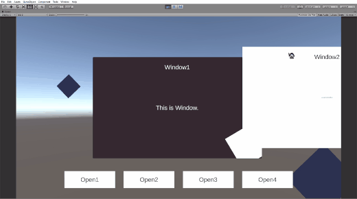

## Get Start
ベーシックなUIのライブラリです.  
インスペクタ上で簡単に設定できます.  
DOTWEENをラッピングしています.

[Releases - unitypackage download](https://github.com/sugichan0116/unity-ui-library/releases)

## Document

1. [Window.cs](#Windowcs)  
1. [UIAnimation.cs](#UIAnimationcs)  
1. [Tab.cs](#Tabcs)  
1. [ScrollList.cs](#ScrollListcs)  
1. [ContentContainer.cs](#ContentContainercs)  
1. [ContentUpdater.cs](#ContentUpdatercs)  

  

---

### Window.cs
基本的なウィンドウです.  
開閉のボタン操作やアニメーション、ポーズ機能を簡単に扱えます.

#### Functions

|function|description|
|---|---|
|Open()|ウィンドウを開く|
|Close()|ウィンドウを閉じる|
|Toggle()|開いていたら閉じ, 閉じていたら開ける|

#### Property

Show detailed properties

|property|type|description|
|---|---|---|
|ShouldInactiveOnPlay|bool|アプリケーションを起動したとき 非アクティブにします|
|ShouldPauseOnOpen|bool|ウィンドウを開いたとき 時間を止めます(timeScale=0)|
|EnableEvents|bool|イベントを有効化します|
|OnOpen|UnityEvent|オープン時に呼び出されます|
|OnClose|UnityEvent|クローズ時に呼び出されます|
|Animations|UIAnimation[]|オープン・クローズ時に再生される アニメーションを設定します|
|SearchAnimations|Function|自分や子供から`UIAnimation.cs`を検索し Animationsに設定します|

  

---

### UIAnimation.cs
`window.cs`に設定するとアニメーションが再生されます.  
継承されたコンポーネントを利用すると簡単にアニメーションが設定できます.

#### Property

Show detailed properties

|property|type|description|
|---|---|---|
|Development|bool|発展設定を有効にします|
|During|float|アニメーションの再生時間[sec]|
|SeparateDuring|bool|アニメーション時間をShowとHideそれぞれに設定します|
|ShowDuring|float|Show時の再生時間[sec]|
|HideDuring|float|Hide時の再生時間[sec]|
|InEase|Ease|Show時のイージングを設定します|
|OutEase|Ease|Hide時のイージングを設定します|
|CustomCurve|bool|イージングをアニメーションカーブで設定します|
|InCurve|AnimationCurve|Show時のイージングを設定します|
|OutCurve|AnimationCurve|Hide時のイージングを設定します|
|SetAnimation|Function|`UIAnimation.cs`を`Window.cs`に設定します|

#### Extention Class

|Component|description|
|---|---|
|UIAnimationCanvasGroup|CanvasGroupのAlpha値をアニメーションします ウィンドウのフェード処理に用います|
|UIAnimationImage|ImageのColorをアニメーションします|
|UIAnimationSlide|Positionをアニメーションします スライドイン処理が得意です|
|UIAnimationRotate|Rotateをアニメーションします|
|UIAnimationScale|Scaleをアニメーションします|

  

---

### Tab.cs
基本的なタブ.  
リンクされた`TabHeader.cs`から受けたインデックスを`ContentContainer.cs`に反映します.  
`ContentContainer.cs`は`ContentUpdater.cs`によって更新されます.  

#### property

Show detailed properties

|property|type|description|
|---|---|---|
|HeaderContainer|ContentContainer|タブのヘッダーコンテナ `TabHeader.cs`が子要素として認識される|
|ContentContainer|ContentContainer|タブのコンテントコンテナ `UIContent.cs`が子要素として認識される|
|Selected|int|選択されているタブインデックス|
|NextTab|Function|次のタブへ移動|
|PreviousTab|Function|前のタブへ移動|
|LinkTabHeader|Function|ヘッダとコンテントをリンクします 実行前に必ずリンクしてください|

  

---

### TabHeader.cs
`UIContent.cs`に紐づけされた見出しです.  
`HeaderContainer`の子要素にしてください  
`SelectTab()`によって`Tab.cs`に更新を働きかけます.

#### Functions

|function|description|
|---|---|
|SelectTab()|ヘッダに紐づいたコンテントへ更新|

#### Property

Show detailed properties

|property|type|description|
|---|---|---|
|SelectTab|Function|ヘッダに紐づいたコンテントへ更新|

  

---

### ScrollList.cs
タブよりもたくさんの要素を管理します.  
ScrollBarによってリストをコントロールできます.

#### Property

Show detailed properties

|property|type|description|
|---|---|---|
|Bar|Scrollbar|リストのコントローラー|
|Container|ContentContainer|リストのコンテナ `UIContent.cs`が子要素として認識される|
|Value|float|インスペクタ上でのスクロール位置|
|UpdateContent|Function|`Value`の位置にコンテントを更新する|
|NextContent|Function|次の要素へ移動する|
|PreviousContent|Function|前の要素へ移動する|

  

---

### ContentContainer.cs
たくさんのUI要素を格納するコンテナです.  
`Tab.cs`などの管理クラスに与えられた情報をもとに`ContentUpdater.cs`で要素の更新を行います.

#### Property

Show detailed properties

|property|type|description|
|---|---|---|
|Updaters|ContentUpdater[]|実行される`ContentUpdater.cs`のリスト|
|SetUpdater|Function|同オブジェクトの`ContentUpdater.cs`を検索して設定する|

  

---

### UIContent.cs
`ContentContainer.cs`の子要素に用いてください

  

---

### ContentUpdater.cs
与えられた情報からUI要素を更新します.  
継承されたコンポーネントを用いると自在なアニメーションが設定できます.

#### Extention Class

|Component|description|
|---|---|
|ContentBasicUpdater|選択された要素のみactiveにします|
|ContentHorizontalUpdater|水平方向に移動するアニメーション `Spacing`を設定すると選択要素の前後に空白が挿入されます|
|ContentVerticalUpdater|垂直方向に移動するアニメーション `Spacing`を設定すると選択要素の前後に空白が挿入されます|
|ContentPlaneUpdater|二次元の移動アニメーションを自由に設定できます `IndexScale` 操作する要素の数 `Magnitude` 移動曲線の大きさ `Movement Curve` 移動曲線(正規化) `Curve Center` 選択要素の移動曲線上の位置|
|ContentImageColorUpdater|選択された要素をハイライトするImageのColorを設定します|
|ContentUnderlineUpdater|下線オブジェクトが選択要素の位置に伸びるように移動します|
|ContentHeroUpdater|選択要素のScaleを設定します|

  

---
